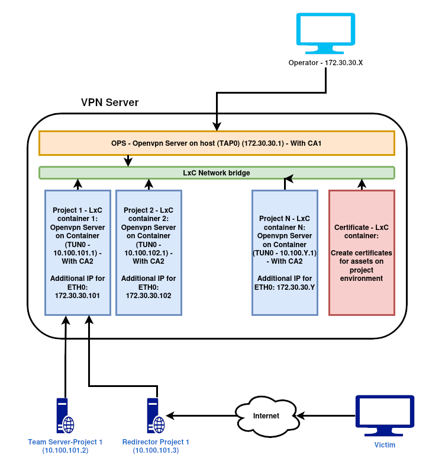

# C2 Setup Automation

This ansible-based solution helps to automate large parts of setting up the C2 infrastructure for a new Red Team engagement. At the moment this is a basic version limited to teamservers (Sliver) and redirectors. But it can easily be adapted to other frameworks or roles.

> **This is meant to be used in testing environments. Why should I not use it for real Red Team engagements?** 
> The scripts assume, you have already created the needed redirectors and teamserver(s) as cloud instances. While this is normal for redirectors, it's not ideal for teamservers. Although the teamserver is only accessible through the VPN, it still would be **better OPSEC to host it on-premise** instead of in the cloud.
> A version of AutoC2 that reflects the latter scenario is planned.

## Features

- Setup a dedicated LxC container for every project on your VPN server
- Install prerequisites packages and harden configuration on machines to be onboarded
- Create a certificate for machines to be onboarded to connect to VPN server and add it to the  VPN server's allow list.
- Setup TeamServer
- Setup Redirector
- Setup VPN connection from machines to be onboarded to your VPN server and block ssh access from the internet.

## Design



>**#TODO:** Setup of the above OpenVPN server needs to be documented in more detail.  
>**#TODO:** Setting up and using the CAs (operator CA and project CA) also needs more documentation.

## Prerequisites

Before you get started, ensure you have the following items:
- Ansible installed on your box
	```
		sudo apt update 
		sudo apt install software-properties-common 
		sudo apt-add-repository --yes --update ppa:ansible/ansible 
		sudo apt install ansible
	```
- Basic Ubuntu instance (scripts can of course be adapted to other distros if preferred) created at your favourite cloud provider for every machine to be onboarded
- Have a OpenVPN server set up as shown above and ssh sudo access to it
- An "Operator CA" and a "Projects CA" set up and under your control 
- The domain(s) to be used for the redirector(s)

## Quick Start

1. **Clone the repository**:    
```
	git clone https://github.com/Pwnd4/AutoC2.git
	cd AutoC2
```

2. **Create Inventory file**
```
./InventoryCreator.sh
Existing projects:
 - *
Enter the project name: <PROJECT_NAME>
Enter the group (e.g. TeamServer, Redirector, etc.): TeamServer
Enter the hostname or IP: <IP_ADDRESS/HOSTNAME>
Enter the ssh user: red
Enter the ssh port: 22
```

3. **Setup a dedicated container for each project on your VPN server so projects are separated**
```
ansible-playbook -K -i inventories/infra_inventory.ini CreateVPNContainer.yml -e "project=<PROJECT_NAME>" -e "target_host=redteam_vpn"
```

- Asks for _sudo password_ on *your OpenVPN server (redteam_vpn)*

4. **Install prerequisites packages and setup hardening configuration on machines to be onboarded**
   Set up password hash and the operators' ssh keys in the "Harden_and_Install.yml" file before running the playbook.
```
ansible-playbook -i '<IP_ADDRESS>,' -e "ansible_ssh_user=<USER_NAME>" -e "ansible_ssh_private_key_file=<PATH_FOR_PRIVATE_SSH_KEY>" -e "ansible_port=22" Harden_and_Install.yml
```

5. **Create  and download the certificate for machines to be onboarded and add them to the the VPN server's allow list. These are prerequisites to connect machines to be onboarded to the VPN server lateron.
```
ansible-playbook -K -i inventories/infra_inventory.ini GetVPNconfig.yml -e "target_host=redteam_vpn" -e "project_name=<PROJECT_NAME>" -e "role_name=<ROLE_NAME>"
```

- ROLE_NAME could be anything, but it is better if it explain the role, like TeamServer, Redirector1, etc.
- Asks for _sudo password_ on _your OpenVPN server (redteam_vpn)_  and _Projects' CA Password_

6. **Setup TeamServer**
```
ansible-playbook -K -i inventories/<PROJECT_NAME>.yml Sliver/Sliver_TeamServer.yml -e "project=<PROJECT_NAME>" -e "operator_names=<COMMA_SEPARATED_USER_NAMES"
```
- Asks for _sudo password_ of _red_ user

7. **Setup Redirector**

	A. In case that you missed the IP address of TeamServer, you can query for assets related to the project

	```
	ANSIBLE_STDOUT_CALLBACK=debug ansible-playbook -K -i inventories/infra_inventory.ini AssetsLookup.yml -e "target_host=redteam_vpn" -e "project=<PROJECT_NAME>"
	```

	- `ANSIBLE_STDOUT_CALLBACK=debug` help you to see the result in a better way!
	- Asks for _sudo password_ on _your OpenVPN server (redteam_vpn)_

	B. Setup redirector with domain assigned to the server

```
ansible-playbook -K -i inventories/<PROJECT_NAME>.yml Sliver/Sliver_Redirector.yml -e "domain=<DOMAIN_NAME>" -e "teamserver_private_ip=<TEAM_SERVER_IP>"
```
- Asks for _sudo password_ of _red_ user


8. **Setup VPN connection from onboarding machine to VPN infrastructure and block ssh access from the internet.**
```
ansible-playbook -K -i inventories/<PROJECT_NAME>.yml SetupVPN.yml -e "target_host=<TARGET_HOST>" -e "openvpn_config_file=<PATH_TO_OVPN_CONFIG_FILE>" -e "setup_role=<TEAMSERVER/REDIRECTOR>"
```

- Asks for _sudo password_ of _red_ user

## Playbook Descriptions

- **CreateVPNContainer.yml**
	- Create a clone from Project-Template container
	- Clean up the configs for Project-Template container and set it up for new project
	- Increase the value for current ID
	- Restart the new container

- **Harden_and_Install.yml**
	- After update the apt package list and upgrade packages, install needed packages:
	- Remove unnecessary packages
	- Stop and disable cups service
	- Install unattended-upgrades package and configure auto-upgrades
	- Ensure permissions on /etc/passwd  and /etc/shadow are configured
	- Ensure no users have .forward files
	- Harden SSH Configuration
		- PermitRootLogin no
		- ChallengeResponseAuthentication no
		- PasswordAuthentication no
		- UsePAM yes
		- X11Forwarding no
		- PrintMotd no
		- PubkeyAuthentication yes
	- Add new user (red) 
	- Add the hash of red's user directly into the shadow file (set that up before runnig it!)
	- Add ssh public key of all operators to *authorized_keys* of red user (set that up before runnig it!)
	- Disable current user at next reboot with cronjob
	- Add new rule on ufw for SSH access and enable it
	- Restart the machine (to disable current user)

- **GetVPNconfig.yml**
	- Get these information: "Projects's CA password" "Project name" "Role"
	- Lookup the database of containers for Project name
	- Set the port of VPN server
	- Collect the username of ansible runner
	- Run */root/Scripts/vpn_cert_checker.sh*
		- Check for certificate duplication
		- Assign the IP address related to new certificate
		- Add the certificate to allow list of VPN server on the container of project
		- Add the certificate name to the database
	- Run /root/Projects/Generate_Project_Config.sh inside of Certificate container to create the OVPN config file with certificate name of `<project_name>-<role>`
	- Delete the new generated certificate from Certificate container if the user agree on this action 

- **Sliver/Sliver-TeamServer.yml**
	- Setup the latest version of Sliver 
	- Create and start systemd service for sliver-server
	- Create operator config files

- **Sliver/Sliver-Redirector.yml**
	- Setup Apache2
	- Open incoming traffic from ports 80/443 on ufw
	- Setup certbot and get the valid certificate for assigned domain
	- Redirect traffic on port 80 to 443
	- Reverse proxy the traffic on port 443 and url of /ec2/home/ to Team server (/ec2/home/) with mod_rewrite

- **SetupVPN.yml**
	- Get VPN config file and push it to the remote machine
	- After establish the VPN connection, find the assigned network and open it on ufw for SSH access
	- Add a rule on ufw for port 80 and 443 for Team Server
	- Deny all incoming traffic from the internet
